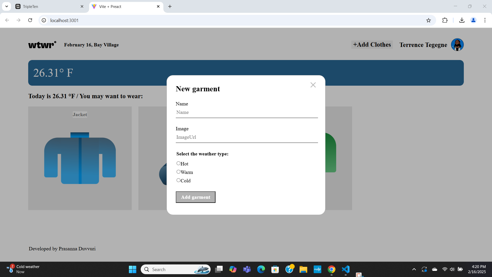

# Project 10: WTWR
## Project name
    What to Wear
### Overview  
  
**Intro**
   In this WtWR project it will give suggestions on  what to wear based on the outside temperature based on API requests. Based on the user location it reads the temperature and it will give suggestions on what to wear. Here User can see the time and location and the temperature outside. And also the user can add cloting items with radio button options and could save his items. 

 **Tecnologies** 
The technologies used in developing this project are React, Vite, css

**Figma** 
https://www.figma.com/design/F03bTb81Pw8IDPj5Y9rc5i/Sprint-10-%7C-WTWR?node-id=311-2970&t=BwwGfl53OfWZkAmy-0
  
**Images** 

**GitHub**
https://github.com/dsrlg/se_project_react

## Project 14 - Front-End Authorization:

### Overview:

- Intro
- Features
- Links

### Intro:

- Project 14 of the WTWR Series was my first ever full-stack one in that it taught me to connect both the front-end and the back-end aspects of it.

- Also, it introduced me to several cybersecurity concepts as they pertain to Web Application Security.

### Features:

- Fron-End Authentication with React
- Web Application Security

### Links:

- Link to the project on GH Pages:

- - Front-End: [(https://github.com/dsrlg/se_project_react.git))]

- - Back-End: [(https://github.com/dsrlg/se_project_express.git)]
